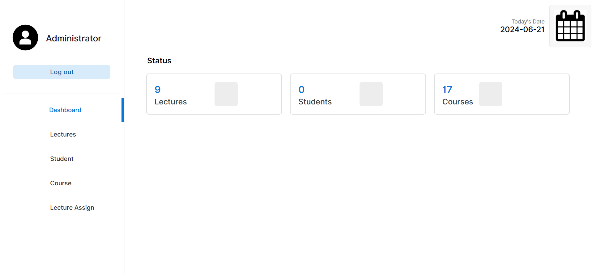
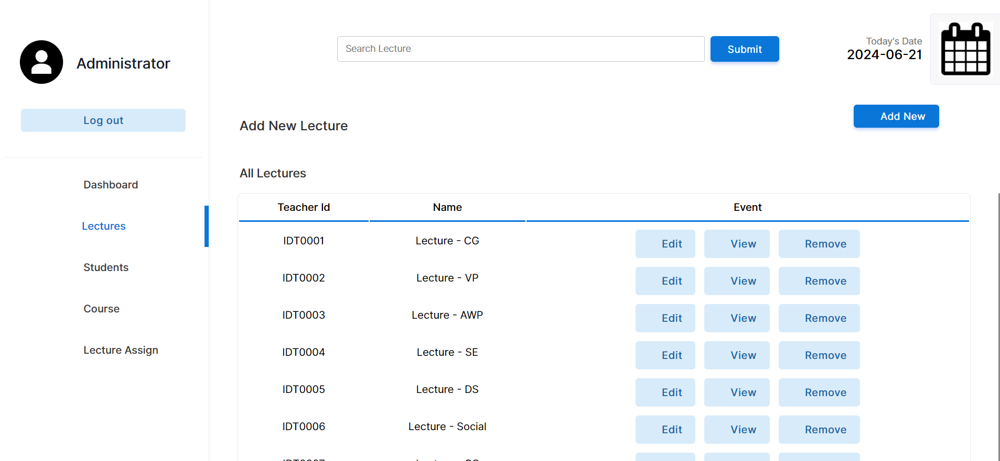
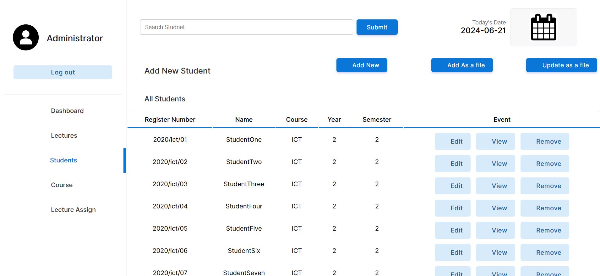
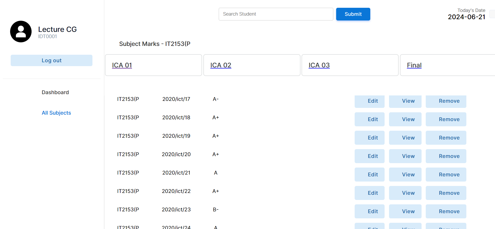

<h4>Table of Contents<h4>
  
  <ol>
    <li>Introduction</a></li>
    <li>Features</li>
    <li>Technologies Used</li>
    <li>Usage</li>
    <li>Application</li>
  </ol>
  

<h4 id='intro'>1. Introduction</h4>
  
Welcome to the Result Management System! This application is designed to streamline and simplify the process of managing and tracking academic results for educational institutions.
  With our system, administrators, teachers, and students can effortlessly handle result-related tasks, ensuring accuracy and efficiency throughout the entire process

 

<h4 id='#feature'>2. Features</h4>
  <ul>
    <li>User registration</li>
    <li>Add teachers and students</li>
    <li>Lecture assign</li>
    <li>Add result</li>
    <li>Update results</li>
    <li>View result status</li>
  </ul>

<h4 id='tech'>3. Technologies Used</h4>
  <ul type='disk'>
    <li>Front-end</li>
      <ul type='circle'>
        <li>HTML</li>
        <li>Css</li>
        <li>Javascript</li>
      </ul>
    <li>Back-end</li>
      <ul type='circle'>
          <li>PHP</li>
          <li>MySql</li>
      </ul>
  </ul>

  <h4>4. Usage</h4>
    <ul type='disk'>
      <li>Admin</li>
      <ul type='cricle'>
        <li>Login</li>
        <li>Add students and teachers</li>
        <li>Add courses</li>
        <li>Lecture Assign</li>
      </ul>
      <li>Teachers</li>
      <ul type='cricle'>
        <li>Add student results</li>
        <li>Update results</li>
        <li>View result status</li>
      </ul>
      <li>Students</li>
      <ul type='cricle'>
        <li>View results</li>
        <li>Calculate GPA</li>
      </ul>
    </ul>
  

  
  <h4>5. Application</h4>
    <ul>
      <li>Login</li>
      <ul type='cricle'>
        <li>All users can log into the system</li>
      </ul>
      
        
      <li>Register</li>
      <ul type='cricle'>
        <li>Teachers and students can register</li>
      </ul>
      
        
      <li>Admin</li>
      <ul type='cricle'>
        <li>Admin - Dashboard</li>
          
        <li>Admin - Lectures</li>
          
        <li>Admin - Students</li>
          
        <li>Admin - Course</li>
          
        <li>Admin - Lecture assign</li>
          
      </ul>
       
      <li>Teacher</li>
        <ul type='cricle'>
          <li>Teacher - Dashboard</li>
            
          <li>Teacher - Subjects assigned</li>
            
          <li>Teacher - Students Results</li>
            
          <li>Teacher - Result status</li>
            
        </ul>
       
      <li>Student</li>
        <ul type='cricle'>
          <li>Student - Dashboard</li>
            
          <li>Student - Semester results</li>
            
        </ul>
    </ul>
  

